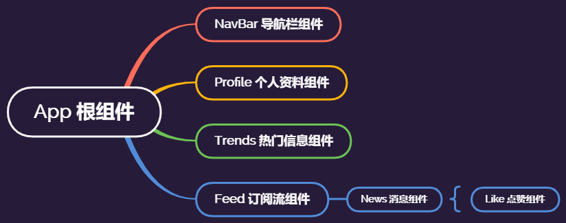
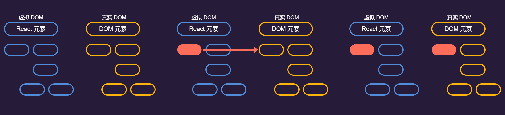

### React 简介

React 是一个用于构筑用户界面（User Interface）的 **JavaScript 库**，由 Facebook 在2011年发布，现在已是非常流行的 JavaScript 库，与 Vue 和 Angular 并列前端三大框架。

### React 的组件化

React 应用的核心都是 **组件 （components）**，组件本质是 UI 的一个片段，当使用 React 来编写应用时，我们会大量编写单独的 、可重复使用的组件，然后把它们组合成复杂的 UI。 每一个 React 应用至少有一个**根组件**，根组件包含了其它**子组件**，所以 React 应用实质上也是一个**组件树**。



### React 的 Virtual DOM

典型的 React 组件（类组件）就是实现一个 `class` 并拥有一些 `state` 和一个 `render` 方法：

```jsx
class NavBar {
    state = {};
    render() {
    }
}
```

上面的代码中，`state` 就是 NavBar 组件在渲染时我们想要显示的数据，`render` 方法用来描述 UI 该怎么显示。`render` 方法输出的是一个 React 元素，它是一个映射到 DOM 元素的 JavaScript 对象，并不是真实的 DOM 元素，它存在内存之中，我们称之为**虚拟DOM（Virtual DOM）**，相较于浏览器可以渲染的**真实DOM（Real DOM）**，虚拟 DOM 创建的开销很小。

当修改了一个组件的 `state` 就会得到一个新的 React 元素，React 会对比新得到的元素与旧元素，包括它们的 `children` ，确认出改变的地方之后会将这些改变更新到 Real DOM，使得 Real DOM 和 Virtual DOM 同步。



因此只需要简单地修改组件的 `state` ，React 会自动更新 DOM 去匹配 `state` ，这意味着我们不再以传统的开发方式（比如使用 jQuery 操作 DOM 和绑定事件）来开发 React 应用。

### React 与 Angular 的区别

和 Angular 不一样的是，Angular 是一个框架、一个完整的解决方案，而 React 是一个JavaScript 库，只关心渲染视图，并且保持视图和 state 同步。

正是因为如此，React 没有太多复杂的 API 要学习，当搭建一个 React 项目时，还需要用到其他库，比如路由、发送 HTTP 请求等，我们可以选择自己喜好的库进行开发。

**React的核心机制之一就是可以在内存中创建虚拟DOM元素，React利用虚拟DOM来减少对实际DOM的操作从而提升性能。  **

### 快速搭建 React 应用

#### 开发环境

- Node.js >= 8.10
- IDE：VScode、Webstorm

#### 创建应用

使用 cerate-react-app 来创建 React 应用，执行如下命令：

```shell
$ npm install create-react-app -g

$ create-react-app my-app
```

执行完毕之后我们就创建了一个 React 应用，包括 Development Server、Webpack、Babel 都已经配置好，只需要再执行命令启动项目：

```shell
$ cd my-app

# 使用npm
$ npm start

# 使用yarn
$ yarn start
```

#### 根组件

用 VS code 打开创建的项目，可以看到主要有两个目录 `public` 和 `src` ，打开 `src/index.js`，可以看到根组件 `App` 在这里被引入，并且渲染到了`public/index.html` 的 `<div id="root"></div> ` 中：

```jsx
// src/index.js
import React from 'react';
import ReactDOM from 'react-dom'; // 引入ReactDOM来渲染组件
import './index.css';
import App from './App';
//...

ReactDOM.render(<App />, document.getElementById('root'));
//...

```

之前提到 React 会在根组件内部渲染子组件，现在来看根组件代码：

```jsx
import React, { Component } from 'react';
import logo from './logo.svg';
import './App.css';

class App extends Component {
  render() {
    return (
      <div className="App">
        <header className="App-header">
          
          <p>
            Edit <code>src/App.js</code> and save to reload.
          </p>
          <a
            className="App-link"
            href="https://reactjs.org"
            target="_blank"
            rel="noopener noreferrer"
          >
            Learn React
          </a>
        </header>
      </div>
    );
  }
}

export default App;

```

可以看到，根组件其实就是一个 ES6 的 `class App` ，它继承了React 的 Component，然后在这个 App 类中，有一个 `render` 方法返回了一段标记，在以前我们没见过在 JavaScript 中返回这种形式的标记，这既不是 string 也是不是HTML，这就是我们所说的 **JSX**。在这里的 JSX 描述了 UI 的样子，就是我们启动之后看到的界面。

### React 的 JSX

JSX 是类似 JavaScript 和 XML 结合的一种扩展格式。React 使用 JSX 为 `React.createElement()` 函数提供语法糖，利用 HTML 语法在  JavaScript  中描述页面。 我们可以访问 [babeljs](https://babeljs.io/repl>) 验证一下，输入JSX代码：

```jsx
const element = <h1>Hello World!</h1>
```

我们可以看到如下结果：

```js
"use strict";

var element = React.createElement("h1", null, "Hello World!");
```

在我们的组件中使用 JSX，通过 babel 把它们转换成 `React.createElement` 会得到 React 元素，通过 JSX 来编写 UI 比直接用 React 来写要**简洁易读**很多。


### 组件编写

#### 创建组件

##### 函数组件

可以使用 JavaScript 函数创建组件，接受 props 对象作为第一个参数并返回 React 元素： 

```jsx
// src/App.js
import React, { Component } from 'react';
import './App.css';
// Greeting 组件
function Greeting({ message }) {
  return <h1>{`Hello, ${message}`}</h1>
}

class App extends Component {
  render() {
    return (
      <div className="App">
        <Greeting message="World"/>  
      </div>
    );
  }
}

export default App;
```

##### 类组件 

使用 ES6 类来定义组件，这就和App根组件是一样的方式： 

```jsx
// src/App.js
import React, { Component } from 'react';
import './App.css';

class App extends Component {
  render() {
    return (
      <div className="App">
        <Greeting message="World"/>  
      </div>
    );
  }
}

export default App;
```

假如需要使用React组件的生命周期方法、状态等，我们就使用类定义组件，新建一个components目录，我们可以将组件都放在这个目录下面，我们一般新建 jsx 为后缀的文件，可以获得更好的代码提示：

```jsx
// src/components/GreetingComponent.jsx
import React, { Component } from 'react';

export default class GreetingComponent extends React.Component {
    render() {
      return <h1>{`Hello, ${this.props.message}`}</h1>
    }
}
```

然后在需要使用的地方引入即可：

```jsx
// src/App.js
import React, { Component } from 'react';
import GreetingComponent from './components/GreetingComponent.jsx';
import './App.css';

class App extends Component {
  render() {
    return (
      <div className="App">
        <GreetingComponent message="World"/>  
      </div>
    );
  }
}

export default App;
```

**注意：上面的代码中，我们在return后面加了( )来包裹JSX，是因为return后面没有内容直接换行的话，JavaScript会在后面补一个“;”，所以当我们的元素需要在return之后换行写的话，记得要用()包裹起来。**

### Props 

Props 用作组件的输入，是一个值或多个值的对象，使用时类似于 HTML 标 属性的方式传递给组件。它们是从父组件传递到子组件的数据。

Props 的主要目的是提供以下组件功能：

1. 将自定义数据传递到组件。
2. 触发状态更改。
3. 在组件的 `render()` 方法中通过 `this.props` 使用。

在前面的例子中，我们就是定义了一个 `message` 属性，并且在父级组件调用时传递了 `message` 的值：

```jsx
<GreetingComponent message="World"/> 
```

然后在 `GreetingComponent` 组件中我们使用 `this.props.message` 得到了父级传过来的值。

### Fragments

前面提到过我们的JSX会被babel编译成 `React.createElement()` 的形式，而`React.createElement()` 第一个参数就需要接收一个元素类型，如果我们并排写了多个元素，babel并不知道我们需要返回的元素类型是什么，代码会异常，紧接着上面代码，假设需要添加一个按钮到 `GreetingComponent` 组件，下面的方式是 **不正确的 **：

```jsx
// src/components/GreetingComponent.jsx
import React, { Component } from 'react';

export default class GreetingComponent extends React.Component {
    render() {
      return <h1>{`Hello, ${this.props.message}`}</h1><button>button</button>
    }
}
```

我们将会得到如下的报错：

```
./src/components/GreetingComponent.jsx
  Line 5:  Parsing error: Adjacent JSX elements must be wrapped in an enclosing tag. Did you want a JSX fragment <>...</>?
```

处理方法1：将需要返回的元素包裹到一个新的元素里面：

```jsx
// src/components/GreetingComponent.jsx
import React, { Component } from 'react';

export default class GreetingComponent extends React.Component {
    render() {
      return <div>
        <h1>{`Hello, ${this.props.message}`}</h1>
        <button>button</button>
      </div>
    }
}
```

通过浏览器审查元素，我们可以看到，有一个 `div` 包裹了 `h1` 和 `button` ，但是我们不需要这个多余的 `div` ，在使用了react 版本 16之后就有了处理方法二：

```jsx
// src/components/GreetingComponent.jsx
import React, { Component } from 'react';

export default class GreetingComponent extends React.Component {
    render() {
      return <React.Fragment>
        <h1>{`Hello, ${this.props.message}`}</h1>
        <button>button</button>
      </React.Fragment>
    }
}
```

将 div 换成了 React.Fragment，当然，我们可以像错误提示里面一样使用 `<></>` 来包裹。

### State

State是组件的状态，它是包含一些属性的一个对象，这些属性的值能在组件的生命周期更改。而每次更改state里面的值，我们的组件都会重新执行render，返回新的JSX，因此要使得状态尽量简单，减少修改和状态组件的使用。以前面的使用为例，增加state：

```jsx
import React, { Component } from 'react';

export default class GreetingComponent extends React.Component {
  constructor(props) {
    super(props)
    this.state = {
      buttonText: '按钮文字'
    }
  }

  render() {
    const { buttonText } = this.state;
    return <React.Fragment>
      <h1>{`Hello, ${this.props.message}`}</h1>
      <button>{buttonText}</button>
    </React.Fragment>
  }
}
```

**state（状态）是私有的，在组件外无法访问。** 

### State和props的异同

相同点

- State和props都是普通的 JavaScript 对象
- State和props都能影响渲染
- State和props都能从父组件接收初始值
- State和props都能在子组件设置默认值
- State和props都能作为子组件的初始值

不同点

- State用于组件内部对自己进行进行管理，props用于传递值到组件
- State不能在父组件改变值，props能在父组件改变值
- State能在组件内部改变，props不能在组件内部改变

### 更新state

直接更新state状态是不能重新渲染的，需要调用 `setState()` 方法。当状态更改时，组件将会重新渲染。

```jsx
// 错误
this.state.message = 'Hello world'

// 正确
this.setState({ message: 'Hello World' })
```

`setState()` 是异步的，当 `setState` 调用之后，组件开始渲染，然后回调函数将会被调用。单不建议使用回调函数处理后续逻辑，应该使用组件的生命周期方法。

```jsx
this.setState({ message: 'Hello World' }, () => {console.log('message更新并渲染')})
```
### 事件处理

#### HTML 

在 HTML 中事件名必须小写：

```html
<button onclick='handleClick()'>
```

在 HTML 中可以返回 `false` 阻止默认的行为：

```html
<a href='#' onclick='console.log("点击链接"); return false;' />
```

#### React 

在 React 中它遵循驼峰惯例：

```jsx
<button onClick={this.handleClick}>
```

在 React 中必须指定 `preventDefault()` 来阻止默认行为：

```jsx
function handleClick(event) {
  event.preventDefault()
  console.log('点击链接')
}
```

### 在 JSX 绑定事件的方式

1、在 Constructor 中绑定， 在 JavaScript 的 Class 中，方法默认不会绑定。在 React的类组件里面也是一样，因此可以在构造函数中绑定：

```jsx
class MyComponent extends React.Componenet {
  constructor(props) {
    super(props)
    this.handleClick = this.handleClick.bind(this)
  }

  handleClick() {
    // 处理逻辑
  }
}
```

2、使用 *public class fields syntax* 代替 `.bind()` ：

```jsx
handleClick = () => {
  console.log(this)
}
// ...

<button onClick={this.handleClick}>点击</button>
```

3、在JSX里面直接使用箭头函数调用事件：

```jsx
<button onClick={(event) => this.handleClick(event)}>点击</button>
```

**注意：** 如果回调函数作为属性传给子组件，那么这些组件可能触发一个额外的重新渲染。在这些情况下，考虑到性能，最好使用 `.bind()` 或 *public class fields syntax* 方案。

### 给事件传递参数

```jsx
{/*使用箭头函数传递参数*/}
<button onClick={() => this.handleClick(id)} />
{/*调用.bind传递参数*/}
<button onClick={this.handleClick.bind(this, id)} />
```

### React 的合成事件

React处理事件接收到的其实是`SyntheticEvent` 实例，这是对浏览器原生事件进行了兼容性封装， API 与浏览器的原生事件相同，包括 `stopPropagation()` 和 `preventDefault()`。如果确实想使用浏览器原生事件，可以使用合成事件的 `nativeEvent` 属性获取。 

### 类组件 & 函数组件

如果组件需要使用**状态或生命周期方法**，那么使用类组件，否则使用函数组件。

### Pure Components & Component

`React.PureComponent` 与 `React.Component` 是一样的。

Pure Components 处理了 `shouldComponentUpdate()` 方法，当属性或状态发生变化时，会对属性和状态进行**浅比较**。

一般的组件不会进行比较。因此在调用 `shouldComponentUpdate` 时，默认返回 true，所以组件都将重新渲染。

### 受控组件 & 非受控组件

受控组件：

在用户输入中够控制表单中输入元素的组件被称为受控组件，可以理解为当状态更改之后，都有对应的处理程序。

例如我们经常处理的change事件，以下面的 `handleChange` 函数为例：

```jsx
// 将输入框的值转换成大写
handleChange(event) {
  this.setState({value: event.target.value.toUpperCase()})
}

// ...
<input type="text" onChange={this.handleChange} />
```

非受控组件：

是在内部存储其自身状态的组件，然后通过 ref 获取 DOM ，从而获取到值，类似于传统的 HTML。

如下面的组件通过 `ref` 获取到输入框，并且取到里面的值：

```jsx
class Profile extends React.Component {
  constructor(props) {
    super(props)
    this.handleSubmit = this.handleSubmit.bind(this)
    this.input = React.createRef()
  }

  handleSubmit(event) {
    alert('提交的name是: ' + this.input.current.value)
    event.preventDefault()
  }

  render() {
    return (
      <form onSubmit={this.handleSubmit}>
        <label>
          {'Name:'}
          <input type="text" ref={this.input} />
        </label>
        <input type="submit" value="Submit" />
      </form>
    );
  }
}
```

大部分情况下我们使用受控组件来实现表单。

### React组件生命周期

#### 组件有三个阶段

**Mounting阶段：**

- 组件将要挂载到浏览器的 DOM 中；
- 包含 `constructor()` 、`getDerivedStateFromProps() `、`render()`  ；
- 包含 `componentDidMount()` 方法的初始化。

**Updating阶段：**

- 组件被挂在到 DOM 中；
- 可以通过 `setState()` 或 `forceUpdate()` 方法更新组件；
- 包含 `getDerivedStateFromProps() `、 `shouldComponentUpdate()` 、  `render() ` 、 `getSnapshotBeforeUpdate()` 和 `componentDidUpdate()` 生命周期方法。

**Unmounting阶段：**

- 组件将会从浏览器 DOM 中卸载；
- 包含 `componentWillUnmount()` 生命周期方法。

### React 生命周期方法

#### React 16.3+

- **getDerivedStateFromProps:**  在调用`render()`之前调用，并在 *每次*  渲染时调用。
- **componentDidMount:**  首次渲染后调用，在这里可以发送 Ajax 请求、更新组件状态状态更新、设置事件监听器等。
- **shouldComponentUpdate:**  确定组件是否更新， 默认返回`true`。 确定在更新状态或属性后不需要渲染组件，则可以返回 `false` 值。 可以通过判断来组织组件重新渲染，从而提高性能。
- **getSnapshotBeforeUpdate:**  在最新的渲染输出提交给 DOM 前将会立即调用，这对于从 DOM 捕获信息（比如：滚动位置）很有用。
- **componentDidUpdate:**  主要用于更新 DOM 以响应 prop 或 state 更改。 如果 `shouldComponentUpdate()`返回`false`，则不会触发。
- **componentWillUnmount：** 当一个组件被从 DOM 中移除时，该方法被调用，取消网络请求或者移除与该组件相关的事件监听程序等应该在这里进行。

#### 16.3之前

- **componentWillMount:**  在组件 `render()` 前执行，用于根组件中的应用程序级别配置。应该避免在该方法中引入任何的副作用或订阅。
- **componentDidMount:**  同上面描述。
- **componentWillReceiveProps:**  在组件接收到新属性前调用，若你需要更新状态响应属性改变（例如，重置它），你可能需对比`this.props`和`nextProps`并在该方法中使用`this.setState()`处理状态改变。
- **shouldComponentUpdate:**  同上面描述。
- **componentWillUpdate:** 当 `shouldComponentUpdate` 返回 `true` 后重新渲染组件之前执行，不能在这调用 `this.setState()` 。
- **componentDidUpdate:** 同上面描述。
- **componentWillUnmount:** 同上面描述。

### React v16 中将被弃用的生命周期方法

以下生命周期方法将成为不安全的编码实践，并且在异步渲染方面会更有问题。

1. `componentWillMount()`
2. `componentWillReceiveProps()`
3. `componentWillUpdate()`

从 React v16.3 开始，这些方法使用 `UNSAFE_` 前缀作为别名，未加前缀的版本将在 React v17 中被移除。

### React的条件表达式

我们都知道，在JavaScript中使用 if 来做条件判断，或者也可以使用三元表达式（`表达式?表达式:表达式`）来实现条件判断。

在 react 的 `JSX` 中，我们也可以嵌入使用三元表达式，不过前提是我们需要将表达式使用大括号（`{}`）包裹起来，比如：

```jsx
<h1>Hello!</h1>
{
    messages.length > 0 && !isLogin ?
      <h2>
          You have {messages.length} unread messages.
      </h2>
      :
      <h2>
          You don't have unread messages.
      </h2>
}
```

还有一点，如果只是想做 if 判断，也可以直接使用 `&&` ,  比如:

```jsx
{
    isLogin && <span>Your have been login!</span>
}
```

上面的代码和 `isLogin ? <span>Your have been login!</span> : null` 实现的效果一样，但是相对来说较为简洁。

### key属性和它的作用

首先在了解 `key` 属性之前，我们需要清楚 react 的虚拟 DOM 和真实 DOM 的关系，这个在前面的学习中已经有介绍，我们需要明白一点就是React会根据我们的虚拟 DOM 的变化来更新真实 DOM，而 `key` 正好可以在这一方面起到辅助作用。

`key` 是一个特殊的字符串属性，当在创建元素的数组时需要使用 `key` 作为属性， 从而让 React 识别哪些项已更改、添加或删除。通常 `key` 都是使用 ID，如：

```jsx
const todoItems = todos.map((todo) =>
  <li key={todo.id}>
    {todo.text}
  </li>
)
```

但是如果在渲染的时候发现没有可靠的作为标识的ID的话，也可以使用 `index` 作为 `key` ，但是使用 `index` 存在一些不好的影响（列表顺序改变时），并不推荐使用。如果没有设置 key ，控制台会报出警告。

```jsx
const todoItems = todos.map((todo, index) =>
  <li key={index}>
    {todo.text}
  </li>
)
```

### refs

*ref*  返回对元素的引用，绝大部分情况下我们都应该避免使用它们，不过它能帮助我们直接访问 DOM 元素或组件的实例。

#### 创建 refs

方式一：

使用 `React.createRef()` 方法创建，然后将创建的实例设置给元素的 `ref` 属性，这是一种新的创建方式。如下面的例子将创建的实例设置给了组件实例，从而可以在组件内全局使用：

```jsx
class MyComponent extends React.Component {
  constructor(props) {
    super(props)
    this.myRef = React.createRef()
  }
  render() {
    return <div ref={this.myRef} />
  }
}
```

方式二：

使用 ref 回调函数，这种方式而不用考虑 React 版本：

```jsx
class SearchBar extends Component {
   constructor(props) {
      super(props);
      this.txtSearch = null;
      this.state = { term: '' };
      this.setInputSearchRef = e => {
         this.txtSearch = e;
      }
   }

   onInputChange(event) {
      this.setState({ term: this.txtSearch.value });
   }

   render() {
      return (
         <input
            value={this.state.term}
            onChange={this.onInputChange.bind(this)}
            ref={this.setInputSearchRef} />
      );
   }
}
```

注意：

- 可以在使用 **closures** 的函数组件中使用refs；
- 不推荐使用内联方式引用回调。

### 弃用 String Refs

在以前我们使用React时，经常会使用这种方式来创建 `ref` ，也就是说 `ref` 的值是一个 `string` ，比如我们有一个代码如：`<div ref={'text'}>text</div> `  ，然后我们访问 DOM 节点的方式就是直接访问 `this.refs.text` 。

现在这种方式已经不建议，因为字符串引用存在一些问题，被认为是历史遗留，因此在 React v16 中被移除。我们来看一看它的问题有哪些：

1、强制 React 跟踪当前执行的组件，它使得 React 模块有状态，会导致在 bundle 中复制 React 模块时会导致奇怪的错误。

2、不可组合，如果一个库把一个 ref 传给子元素，则用户无法对其设置另一个引用。

3、不能与静态分析工具一起使用（如 Flow）。Flow 无法猜测出 `this.refs` 上的字符串引用的作用及其类型（callback refs 对静态分析更友好）。

4、使用 "render callback" 模式，它无法像大多数人预期的那样工作。比如下面的例子：

```jsx
class MyComponent extends Component {
  renderRow = (index) => {
    // 不能正常工作, fef引用的是DataTable而非MyComponent
    return <input ref={'input-' + index} />;

    // 这将正常工作
    return <input ref={input => this['input-' + index] = input} />;
  }

  render() {
    return <DataTable data={this.props.data} renderRow={this.renderRow} />
  }
}
```

### forward refs

forward refs允许某些组建获取到ref对象之后，将ref对象传到它的子组件的一种特性。可以参考下面例子：

```jsx
const ButtonElement = React.forwardRef((props, ref) => (
  <button ref={ref} className="CustomButton">
    {props.children}
  </button>
));

// 给button元素创建ref
const ref = React.createRef();
<ButtonElement ref={ref}>{'Forward Ref'}</ButtonElement>
```

### 查找 DOM 的方式

我们可以使用 `callback refs` 和 `findDOMNode()` 查找元素，但是推荐使用 `callback refs` ，因为 `findDOMNode()` 阻碍将来 React 一些改进，因此这个方法已经被弃用。但是不妨来看看这种方案的使用示例：

```jsx
class MyComponent extends Component {
  componentDidMount() {
    findDOMNode(this).scrollIntoView()
  }

  render() {
    return <div></div>
  }
}
```

而使用 `callback refs` 是推荐的方案，它的使用示例如下：

```jsx
class MyComponent extends Component {
  componentDidMount() {
    this.node.scrollIntoView()
  }

  render() {
    return <div ref={node => this.node = node} />
  }
}
```

### 在类组件中获取正确的 `this` 上下文

在JavaScript的class中，方法默认是不会绑定的，意味着它们的 `this` 上下文会随着我们的调用而改变（比如在事件绑定中会指向元素），从而不能获取到组件实例。为了解决这个问题，我们可以使用 `Function.prototype.bind()` 来强制让 `this` 上下文绑定到组件实例：

```js
constructor(props) {
  super(props);
  this.handleClick = this.handleClick.bind(this);
}

handleClick() {
  // 一些逻辑
}
```

使用 `bind` 会显得比较冗长，因为我们需要一个 `constructor` ，因此我们也趋向于使用箭头函数的形式， public class fields 规则：

```js
handleClick = () => {
  console.log('this is:', this);
}

render() {
  return (
    <button onClick={this.handleClick}>
      Click me
    </button>
  );
}
```

当然你也可以使用代码行内的箭头函数：

```js
<button onClick={e => this.handleClick(e)}>Click me</button>
```

注意：上面的方式将会在渲染的时候创建一个新的方法实例，当方法传递到子组件时，会破坏`shouldComponentUpdate` / `PureComponent` 的隐藏检查机制，从而导致不必要的重渲染。在对于性能要求重要的场合，趋向于使用 `bind` 或者  public class fields ，因为方法的引用始终是不变的。

### 状态提升（lifting state up）

当多个组件需要共享同一个数据时，状态提升到最近的祖先上。比如两个子组件如果共享了同一个数据， 那就把这个数据移动到它们的父组件，而不是分别放在子组件里面。

### 注释的写法

注释需要使用 `{}` 包裹，并且使用 `/* */` 语法。

```jsx
const tree = (
  <div>
    {/* Comment */}
    <p>Text</p>
  </div>
)
```